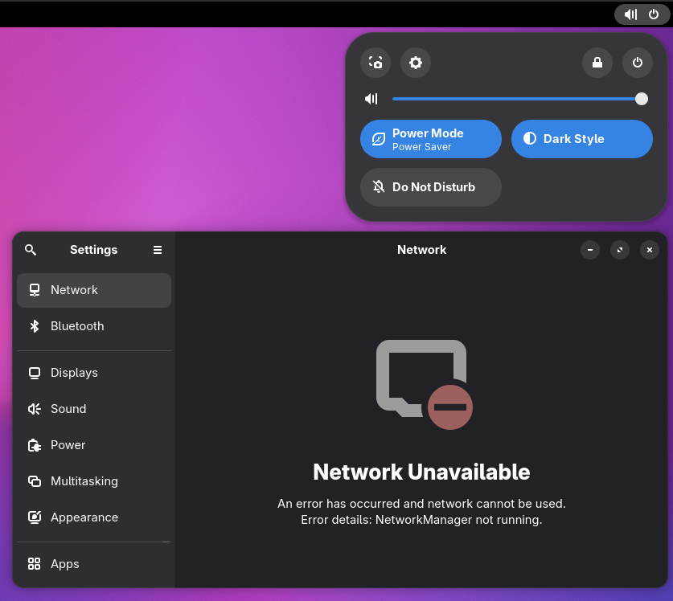
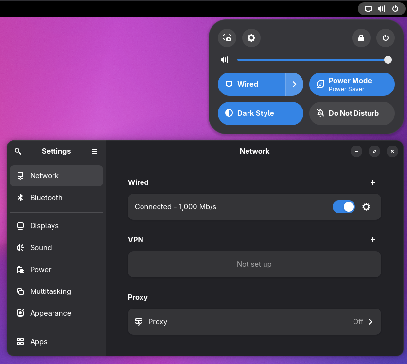

# nmlinkd

[](LICENSE)
[](../../releases)
[](https://aur.archlinux.org/packages/nmlinkd)

NetworkManager D-Bus bridge for netlink-based network stacks.

## Overview

nmlinkd exposes the NetworkManager D-Bus API by reading network state directly from the Linux kernel via netlink. This allows desktop environments to display network status without requiring NetworkManager itself. Works with any network configuration (systemd-networkd, dhcpcd, iwd, manual, etc).

## Why nmlinkd?

Many desktop environments rely on NetworkManager's D-Bus API to display network status. If you prefer a different network manager (systemd-networkd, dhcpcd, iwd) or manual configuration, you lose UI integration.

nmlinkd solves this by acting as a read-only NetworkManager API server, reading state from the kernel and presenting it in a format desktop environments expect.

| Before | After |
|:-:|:-:|
| |  |

## Features

Should work with desktop environments that use the NetworkManager D-Bus API (GNOME, KDE Plasma, Cinnamon, Budgie, MATE, COSMIC).

- Network status indicator icon in GNOME Shell / KDE
- Enable/disable interfaces
- Connection details
- Hotplug interfaces support
- D-Bus activated — starts automatically when needed

## Installation

### Arch Linux (AUR)

```bash
yay -S nmlinkd
```

### Pre-built binaries

See [Releases](../../releases) for pre-built tarballs.

## Requirements

- Linux kernel with netlink support (any modern kernel)
- D-Bus system bus
- Root privileges (required for netlink socket and D-Bus system bus)

**Conflicts with:**
- NetworkManager (cannot run simultaneously)

## How it works

```
Linux Kernel → netlink → D-Bus → Desktop Environment
```

nmlinkd subscribes to kernel netlink events:
- `RTMGRP_LINK` - interface up/down, flags
- `RTMGRP_IPV4_IFADDR` / `RTMGRP_IPV6_IFADDR` - IP address changes
- `RTMGRP_IPV4_ROUTE` / `RTMGRP_IPV6_ROUTE` - routing table changes

It translates these into NetworkManager D-Bus API signals and properties that desktop environments expect.

## Limitations

- **Read-only**: Cannot create or edit connections from Settings (network config lives in files/tools)
- **No VPN management**: VPN interfaces (WireGuard, OpenVPN) are filtered out. NetworkManager's VPN API requires active connection management beyond the scope of a read-only bridge.

## License

Copyright (C) 2026 subz69  
Licensed under [MIT](LICENSE)
