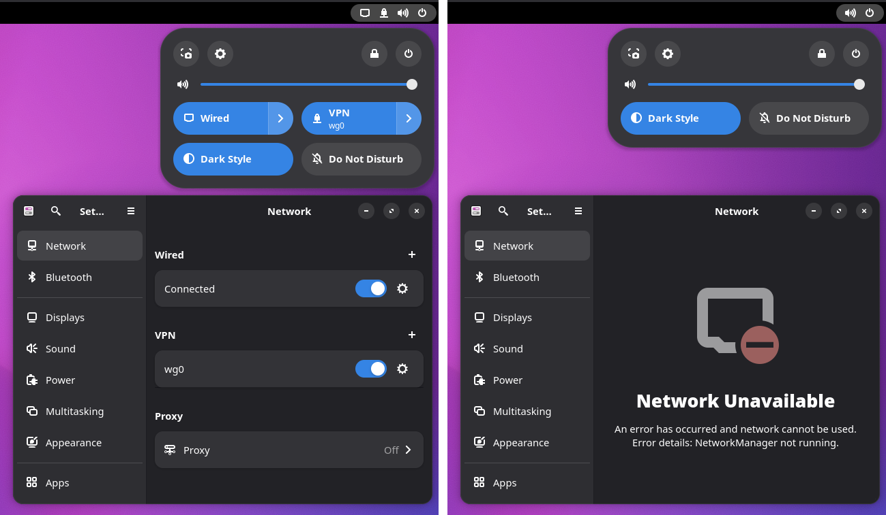

# nmlinkd

[](LICENSE)
[](../../releases)
[](https://aur.archlinux.org/packages/nmlinkd)

**Native GNOME/KDE network indicator for systemd-networkd, iwd, dhcpcd. No NetworkManager required.**



## Why nmlinkd?

GNOME, KDE Plasma, COSMIC and most Linux desktops display network status by talking to NetworkManager over D-Bus. If you've chosen a different stack (systemd-networkd, dhcpcd, iwd, ifupdown, or manual config), that indicator goes silent.

nmlinkd is a tiny daemon that reads network state directly from the Linux kernel via netlink and re-exposes it through the NetworkManager D-Bus API. Your desktop sees a "NetworkManager", but it's just nmlinkd mirroring whatever the kernel actually has.

Read-only by design: configuration lives in your tools of choice; nmlinkd only reflects the state.

## Features

Works with any DE that consumes the NetworkManager D-Bus API (GNOME, KDE Plasma, Cinnamon, Budgie, MATE, COSMIC).

- Network status indicator (wired, WireGuard)
- Real internet connectivity detection (captive portals, dead gateways)
- Enable/disable interfaces from the indicator
- Connection details panel
- WireGuard toggle (treated as VPN entry)
- Hotplug support (USB ethernet adapters, etc.)
- D-Bus activated (starts automatically when needed)

## Installation

### Arch Linux (AUR)

```bash
yay -S nmlinkd
```

### Pre-built binaries

See [Releases](../../releases) for pre-built tarballs.

## Requirements

- Linux kernel with netlink support (any modern kernel)
- D-Bus system bus
- Root privileges (required for netlink socket and D-Bus system bus)

**Conflicts with:**
- NetworkManager (cannot run simultaneously)

## How it works

```
Linux Kernel → netlink → D-Bus → Desktop Environment
```

nmlinkd subscribes to kernel netlink events:
- `RTMGRP_LINK` - interface up/down, flags
- `RTMGRP_IPV4_IFADDR` / `RTMGRP_IPV6_IFADDR` - IP address changes
- `RTMGRP_IPV4_ROUTE` / `RTMGRP_IPV6_ROUTE` - routing table changes

It translates these into NetworkManager D-Bus API signals and properties that desktop environments expect.

## Limitations

- **Read-only**: Cannot create or edit connections from Settings (network config lives in files/tools)
- **Wi-Fi shown as wired**: Wi-Fi interfaces (e.g. managed by iwd) are visible but appear as ethernet devices. Wi-Fi-specific features (SSID, signal strength, access point scanning) are not implemented.

## License

Copyright (C) 2026 subz69  
Licensed under [MIT](LICENSE)
